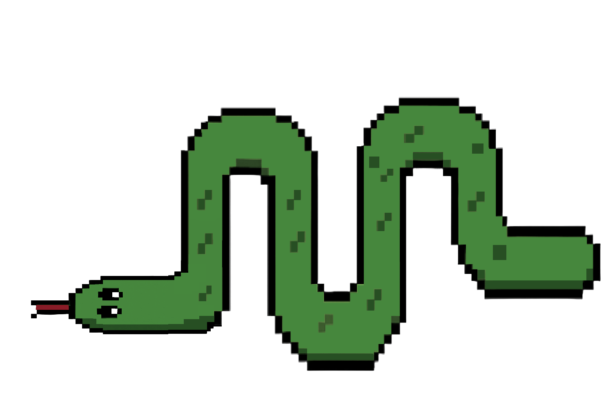

    <strong><em>Snake ...</em></strong> 
     

# ***1. Projekt końcowy Podstawy informatyki***
Gra snake stworzona na potrzeby zaliczenia laboratoriów podstawy informatyki. Projekt ma mieć postać klasycznej lub własnej interpretacji gry snake w terminalu lub wykorzystaniem biblioteki graficznej.

# ***2. Opis.***
Nasz projekt jest właściwie naszą własną interpretacją gry Snake, który bazuje, jest mocno inspirowana życiem studenckim i życiem uczelni. Chcieliśmy stworzyć coś innego niż klasyczny Snake i zdecydowaliśmy się właśnie na ten kierunek, by było to coś autorskie i odświeżenie w pewien sposób tego klasyku.

# ***3. Szczegóły projektu - gry.***
Gra wykorzystuje bibliotekę graficzną SFML-3.0.2 . Po przejściu do gry przez wciśnięcie przycisku generowana, wyświetlana jest strona, główne okno z planszą gry. Na bazie założeń jest to gra mająca 7 poziomów, co odpowiada 7-miu dniom tygodnia. W grze są obecne power-upy, a po uzsykaniu określonej liczby punktów i ukończeniu poziomu pojawia się przejście do kolejnego.
Szczegóły, mechaniki:

# ***4. Techniki programistyczne i biblioteki w projekcie.***
Zaawansowane techniki programistyczne:
-Wykorzystywanie wskaźników
-Programowanie obiektowe
-Wykorzystywanie plików ".h" (header files) do deklaracji funkcji, czy typów zmiennych - do zdefiniowania w utworzonym pliku ".cpp"
Wykorzystywane biblioteki:
-SFML
-TGUI (stworzona dla SFML, z większą ilością wbudowanych funkcjonalności)
... podstawowe tez??

# ***5. Instrukcja uruchomienia gry.
W celu uruchomienia gry należy przejść do lokalizacji folderu "build", path to "Projekt_koncowy_PI/projectMainDir/build/" tam następnie w terminalu wpisać: 
`./projektGra` 
Ewnetualnie, opcjonalnie można zrobić kolejno: 
`make` `./projektGra`

        Autorzy: 
        &nbsp;&nbsp;
        &nbsp;&nbsp;
        
    

